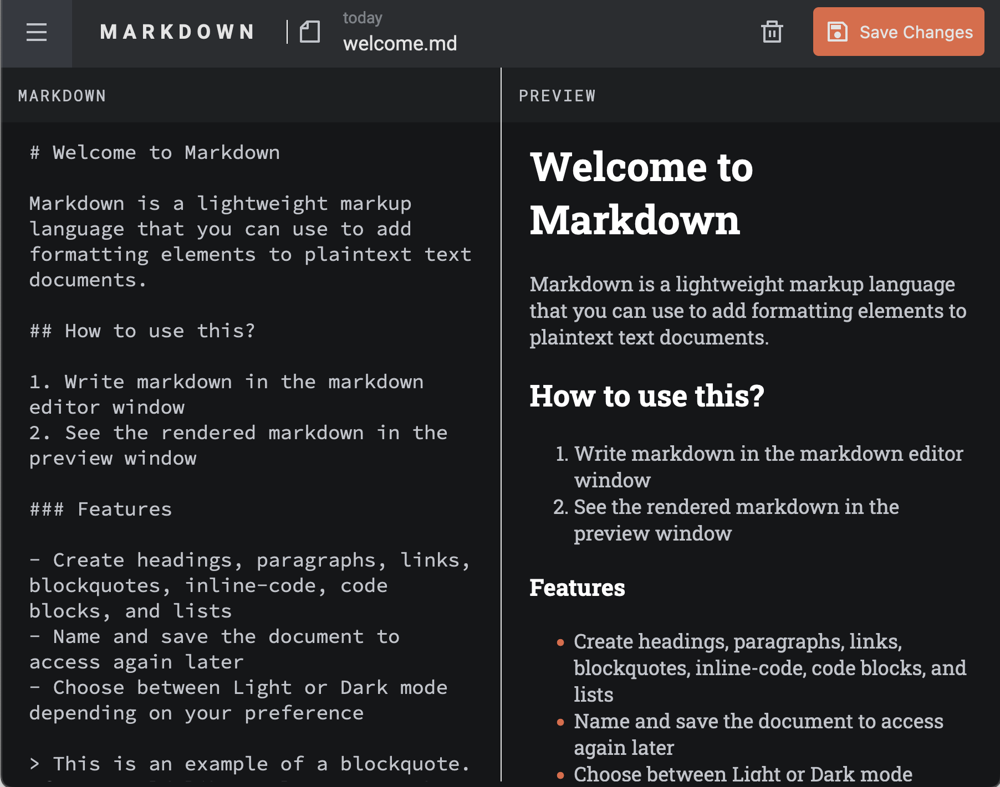

# Markdown editor

A simple markdown editor built with [React js](https://react.dev/).

The designs are from a [challenge by frontendmentor.io](https://www.frontendmentor.io/challenges/tic-tac-toe-game-Re7ZF_E2v)

> Frontendmentor is a platform offering, some free and paywalled professional designs for frontend developers to create stunning projects.

## [Live Preview](https://mde.alvs.dev)

## Clone this?

Follow these steps if you want to clone this and play around with the code.

1.  `pnpm i` if you want to use some other package manager like yarn or npm, delete the pnpm-lock.yaml file before doing so.
2.  Start tinkering.

## Steps followed

These are the steps i followed in creating the initial setup.

1. `pnpm create vite@latest markdown-editor --template react-ts`
2. `pnpm i vite-plugin-svgr` [svgr](https://www.npmjs.com/package/vite-plugin-svgr) converts svg files as react components.

## Useful resources

-   [React docs](https://react.dev/)
-   [pnpm docs](https://pnpm.io/installation)
-   Interactive [React js course](https://scrimba.com/learn/learnreact/) by Bob Ziroll on Scrimba
